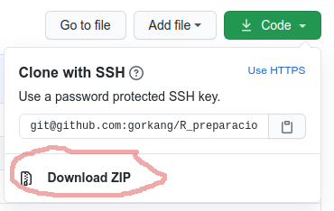

# R para preparación y visualización de datos

Doctorado en Neurociencia Social y Cognición, Facultad de Psicología, UAI

Gorka Navarrete, ORCID: [0000-0001-7678-8656](http://orcid.org/0000-0001-7678-8656)

En este repositorio se encuentran los materiales del workshop *R para preparación y visualización de datos*. El curso está centrado en el uso de R para la preparación y visualización de datos, además de la generación de reportes reproducibles.

## Objetivos

Aportar herramientas básicas para trabajar de manera autónoma con R y RStudio para el proceso de importación, transformación, visualización y reporte de datos.

Al finalizar el curso deberíamos ser capaces de:  

* Importar archivos de datos, transformar los datos, crear nuevas variables  
* Realizar análisis de datos exploratorios, visualizar distribuciones y comparar grupos  
* Generar reportes reproducibles con RMarkdown  
* Crear paradigmas experimentales y un pipeline completo para la preparación de datos con [jsPsychR](https://gorkang.github.io/jsPsychR-manual/index.html)  

## Como empezar

Consulta las [instrucciones sobre como empezar en el libro online del workshop](https://gorkang.github.io/R_preparacion_visualizacion_datos/index.html#como-empezar).  

### Whoooot?

Si las instrucciones del manual no tienen sentido:  

1. Descargate este workshop (`Download ZIP`; ver abajo)
2. Descomprime el ZIP  
3. Abre el archivo: `R_preparacion_visualizacion_datos-master/_book/preparando-sistema.html`  
4. Sigue las instrucciones que ahí aparecen  

  
